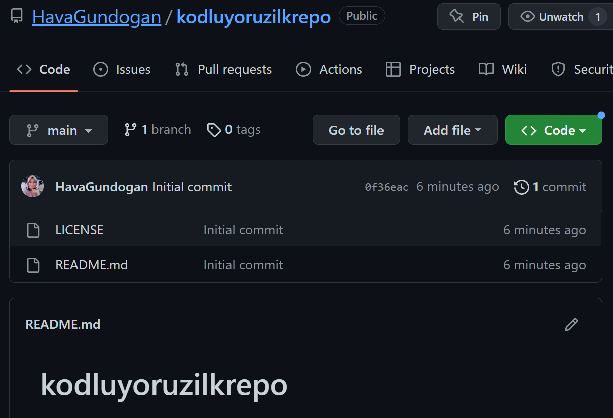

# kodluyoruzilkrepo
Bu repo [kodluyoruz](https://kodluyoruz.org/tr) Front-End Eğitiminde oluşturduğumuz ilk repo. İçerisinde bir adet README dosyası, bir adet de index.html barındırıyor.

## Installation
[Öncelikle projeyi clonelayın.] (https://github.com/HavaGundogan/kodluyoruzilkrepo.git)
>git clone https://github.com/HavaGundogan/kodluyoruzilkrepo.git
## Usage
Projeyi cloneladıktan sonra Visual Studio Code programında açınız.

Linux için:
''' cd kodluyoruzilkrepo'''
''' code .'''
## Contributing
Pull requestler kabul edilir. Büyük değişiklikler için, lütfen önce neyi değiştirmek istediğinizi tartışmak için bir konu açınız.
## License
[MIT](https://choosealicense.com/licenses/mit/)